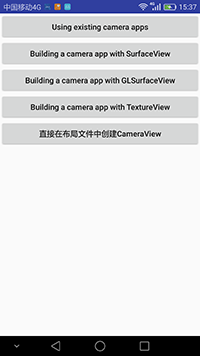
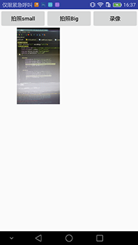
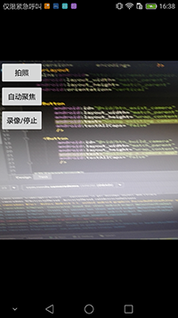

# Camera 用法介绍

效果图:

## 使用系统自带Camera进行拍照和录像

拍小图片

    /**
     * 使用系统Camera App 拍一张小图片
     */
    private void takeSmallPicture() {
        Intent takePictureIntent = new Intent(MediaStore.ACTION_IMAGE_CAPTURE);
        if (takePictureIntent.resolveActivity(getPackageManager()) != null) {
            startActivityForResult(takePictureIntent, REQUEST_TAKE_PHOTO_S);
        }
    }

	@Override
	protected void onActivityResult(int requestCode, int resultCode, Intent data) {
		switch (requestCode) {
			case REQUEST_TAKE_PHOTO_S:
				if (resultCode == RESULT_OK) {
				   Bundle extras = data.getExtras();
					mImageBitmap = (Bitmap) extras.get("data");//data 是一个很小的图片数据, 通常用于获取一个icon
					mImageView.setImageBitmap(mImageBitmap);
				}
				break;
		}
	}

拍大图片:大图片就是指直接拍出来的图片. 过程和上面几乎是一样的, 只不过在启动Activity的时候传递了一个路径的Uri,标识图片存储的位置. 而在使用图片时, 也是根据该Uri来把File解析成Bitmap, 而非在 onActivityResult() 回调中获取图片数据

	private void takeBigPicture() {
		Intent takePictureIntent = new Intent(MediaStore.ACTION_IMAGE_CAPTURE);
		if (takePictureIntent.resolveActivity(getPackageManager()) != null) {
			// Create the File where the photo should go
			File photoFile = null;
			try {
				photoFile = createImageFile();
			} catch (IOException ex) {
				// Error occurred while creating the File
				ex.printStackTrace();
			}
	
			if (photoFile != null) {

				takePictureIntent.putExtra(MediaStore.EXTRA_OUTPUT, Uri.fromFile(photoFile)); // api24之前的版本可以直接使用 file://URI. 代码中为了兼容api24及以上使用的是 FileProvider 来获取Uri
				startActivityForResult(takePictureIntent, REQUEST_TAKE_PHOTO_B);
			}
		}
	}

录像: 这个过程是最简单的

    /**
     * 启动系统 Camera 来录像
     */
    private void takeVideo() {
        Intent takeVideoIntent = new Intent(MediaStore.ACTION_VIDEO_CAPTURE);
        startActivityForResult(takeVideoIntent, REQUEST_VIDEO_CAPTURE);
    }

	@Override
	protected void onActivityResult(int requestCode, int resultCode, Intent data) {
		switch (requestCode) {
			case REQUEST_VIDEO_CAPTURE:
				if (resultCode == RESULT_OK) {
					mVideoUri = intent.getData();
					Log.d(TAG, "mVideoUri: " + mVideoUri);
					mVideoView.setVideoURI(mVideoUri);
				}
				break;
		}
	}

## 自定义Camera配置进行拍照和录像
** Demo 中包含 SurfaceView, GLSurfaceView, TextureView 三种用法**

	/**
	 * 对于大多数Camera的应用, 方向好像是固定为 portrait 或 landscape, 是不支持随着屏幕的旋转而旋转的
	 * 

	 * Building a camera app  步骤
	 * 一. Capturing pictures
	 * 1. Detect and Access Camera
	 * 2. Create a Preview Class (extends SurfaceView and implements the SurfaceHolder interface)
	 * 3. Build a Preview Layout
	 * 4. Setup Listeners for Capture
	 * 5. Capture and Save Files
	 * 6. Release the Camera
	 * 

	 * 二. Capturing video
	 * Unlike taking pictures with a device camera, capturing video requires a very particular call order.
	 * 

	 * Starting with Android 4.0 (API level 14), the Camera.lock() and Camera.unlock() calls are managed for you automatically.
	 * 

	 * 1. Open Camera
	 * 2. Connect Preview
	 * 3. Start Preview
	 * 4. Start Recording Video
	 * - a. Unlock the Camera  - Unlock the camera for use by MediaRecorder by calling Camera.unlock().
	 * - b. Configure MediaRecorder ( following are MediaRecorder methods)
	 * -- 1. setCamera()
	 * -- 2. setAudioSource(MediaRecorder.AudioSource.CAMCORDER)
	 * -- 3. setVideoSource(MediaRecorder.VideoSource.CAMERA)
	 * -- 4. Set the video output format and encoding. For Android 2.2 (API Level 8) and higher, use the MediaRecorder.setProfile method,
	 * --    and get a profile instance using CamcorderProfile.get(). For versions of Android prior to 2.2, you must set the video output format and encoding parameters:
	 * ---- 1) setOutputFormat(MediaRecorder.OutputFormat.MPEG_4)
	 * ---- 2) setAudioEncoder(MediaRecorder.AudioEncoder.DEFAULT)
	 * ---- 3) setVideoEncoder(MediaRecorder.VideoEncoder.DEFAULT)
	 * -- 5. setOutputFile()
	 * -- 6. setPreviewDisplay()
	 * - c. Prepare MediaRecorder
	 * - d. Start MediaRecorder
	 * 5. Stop Recording Video
	 * - a. Stop MediaRecorder
	 * - b. Reset MediaRecorder
	 * - c. Release MediaRecorder
	 * - d. Lock the Camera - Lock the camera so that future MediaRecorder sessions can use it by calling Camera.lock().
	 * -    Starting with Android 4.0 (API level 14), this call is not required unless the MediaRecorder.prepare() call fails.
	 * 6. Stop the Preview - Camera.stopPreview().
	 * 7. Release Camera - Camera.release().
	 * 

	 * 

	 * 注意：它可以使用MediaRecorder 而不用首先创建一个相机预览，并且跳过这一过程中前几个步骤。然而，由于在开始录制之前用户通常更愿意看到一个预览，这个过程不再这里讨论。
	 * 提示：如果您的应用程序通常用于录制视频，以开始预览之前，设置setRecordingHint(boolean)为true 。此设置可以帮助减少需要录制的时间。
	 * 

	 * 

	 * Camera features:
	 * 

	 * Most camera features can be accessed(接近,获取) and set using the through Camera.Parameters object.
	 * However, there are several important features that require more than simple settings in Camera.Parameters. These features are covered in the following sections:
	 * * Metering and focus areas (测光和焦点区域)
	 * * Face detection (面部检测)
	 * * Time lapse video (时间推移视频, 即延迟摄影)
	 * 

	 * 所以, Camera features 分为两类:
	 * simple settings (using Camera.Parameters object.)
	 * complex settings (上面显示的三个特点)
	 * 

	 * Camera.Parameters对象提供了getSupported ...（） ， is...Supported()或GetMax的...（）方法，以确定是否（以及多大程度上）支持此功能。
	 * 

	 * 

	 * // get Camera parameters
	 * Camera.Parameters params= mCamera.getParameters();
	 * // set the focus mode
	 * params.setFocusMode(Camera.Parameters.FOCUS_MODE_AUTO);
	 * // set Camera parameters
	 * mCamera.setParameters(params);
	 * 

	 * 像上面这种形式适用于几乎所有的拍照功能，而且在你获得Camera对象的实例以后大多数参数可以在任何时候改变(注意: 当给params设置好了参数后,一定不要忘了再把params设置给mCamera, 否则不会起效)。
	 * 但是注意: 一些摄像功能不能随意更改。尤其是，改变相机预览的大小和方向，您需要先停止预览，再改变预览大小，然后重新启动预览。从Android 4.0（API等级14）开始，预览方向的改变不再需要重新启动预览。
	 * 

	 * 但是对于Metering and focus areas, Face detection, Time lapse video 这些复杂功能的实现, 就需要更多更多的代码, 不能是这么简单的了
	 * 

	 * Camera.Area对象包含两个数据参数：一个 Rect是为指定摄像机视图之内的区域和一个权重值.
	 * 在Camera.Area对象中的Rect区域描述一个矩形被映射到一个2000×2000单元格上, 即preview区域, 而且是以中心点为坐标原点的, 向右为x正方向, 向下为y正方向.
	 * 这个2000×2000单元格的坐标系统是固定不变的,不会随着图像的缩放级别或预览方向的变化而变化
	 * 

	 * 在您的相机应用程序使用脸部识别功能需要几个基本步骤：(MI4并不好使)
	 * 1. 检查设备支持人脸检测（Check that face detection is supported on the device）
	 * 2. 创建人脸检测监听器（Create a face detection listener
	 * 3. 将人脸检测监听加入到你的Camera对象（Add the face detection listener to your camera object
	 * 4. 预览后启动人脸检测（每次预览都要重新启动）（Start face detection after preview (and after every preview restart))
	 * While the face detection feature is running, setWhiteBalance(String), setFocusAreas(List<Camera.Area>) and setMeteringAreas(List<Camera.Area>) have no effect.
	 * 

	 * 

	 * Time lapse video 延迟摄影(其实就是每秒只抓取几帧而已)
	 * // Step 3: Set a CamcorderProfile (requires API Level 8 or higher)
	 * mMediaRecorder.setProfile(CamcorderProfile.get(CamcorderProfile.QUALITY_TIME_LAPSE_HIGH));
	 * ...
	 * // Step 5.5: Set the video capture rate to a low number
	 * mMediaRecorder.setCaptureRate(0.1); // capture a frame every 10 seconds
	 * 

	 * Camera 一旦调用了release()方法后, 就不能再次使用了, 除非又重新调用 Camera.Open() 方法
	 * 

	 * =====================================================================================================
	 * 

	 * 预览、拍照、自动聚焦、触摸聚焦、连续拍照、照片存储, 预览拉伸问题解决
	 * // width, height: [(240, 160),(320, 240),(480, 320),...,(1920, 1080)]
	 * List<Camera.Size> supportedPreviewSizes = mCamera.getParameters().getSupportedPreviewSizes();
	 * parameters.setPreviewSize(optimalSize.width, optimalSize.height); // 设置预览界面的大小. 经测试, 当SurfaceView大小一样的情况下, PreviewSize 越大预览界面越清晰
	 */

